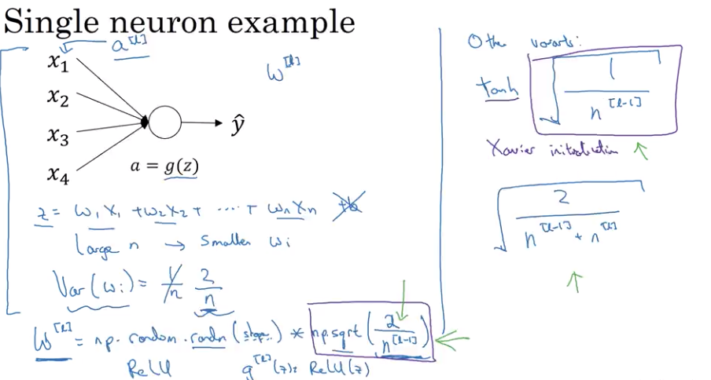
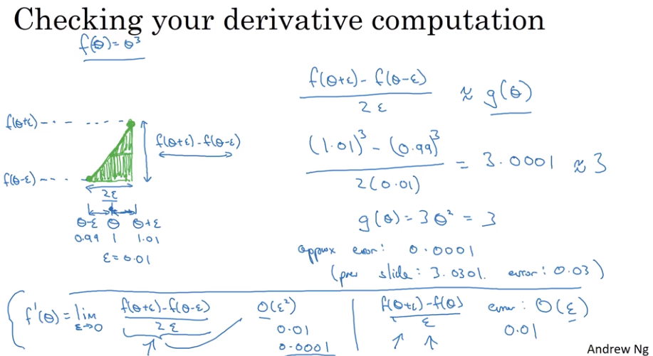
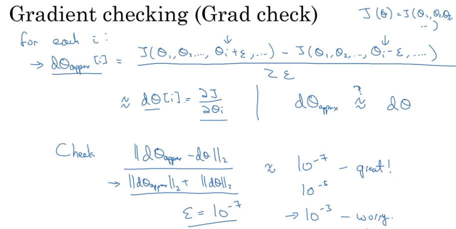

# Improving Deep Neural Networks: Hyperparameter tuning, Regularization and Optimization

Notes from course-2 of the [Deep Learning specialization](https://www.coursera.org/specializations/deep-learning) in Coursera

- [Improving Deep Neural Networks: Hyperparameter tuning, Regularization and Optimization](#improving-deep-neural-networks-hyperparameter-tuning-regularization-and-optimization)
  - [Week 1 - Setting up your ML application](#week-1---setting-up-your-ml-application)
    - [Choosing train/dev/test sets](#choosing-traindevtest-sets)
    - [Bias and Variance](#bias-and-variance)
    - [Basic recipe for Machine Learning](#basic-recipe-for-machine-learning)
    - [Regularization](#regularization)
    - [Why regularization reduces overfitting?](#why-regularization-reduces-overfitting)
    - [Dropout Regularization](#dropout-regularization)
    - [Understanding Dropout - Why it works?](#understanding-dropout---why-it-works)
    - [Other Regularization Methods](#other-regularization-methods)
    - [Normalizing Inputs](#normalizing-inputs)
    - [Vanishing/Exploding Gradients](#vanishingexploding-gradients)
    - [Weight initialization for deep networks (single neuron example)](#weight-initialization-for-deep-networks-single-neuron-example)
    - [Numerical approximation of gradients](#numerical-approximation-of-gradients)
    - [Gradient checking](#gradient-checking)
    - [Gradient Checking Implementation Notes](#gradient-checking-implementation-notes)
  - [References](#references)

## Week 1 - Setting up your ML application

### Choosing train/dev/test sets

- Applied ML is highly iterative..remember idea==>code==>experiment cycle.
- Many different applications..but the intuition from one application may not transfer to other application due to differences in data
- Trends in choosing the train/dev/test datasets. dev set is nothing but cross-validation set.
- Typical split used to be: 60-20-20
- For some big data applications, the ratio would be something in the order of 98:1:1 or even lesser.
- Mismatched train/test distributions
  - E.g cat classifier
  - training set - cat pictures from webpages
  - dev/test set - cat pictures from user uploaded images
  - make sure that dev/test set come from the same distribution
- Sometimes it might be okay to not have a test set. (some people may call train/dev set as train/test set.) Why test set is needed? - to eliminate bias and avoid overfitting to the training set.

### Bias and Variance

- Difficulties in plotting decision boundary in higher dimensions
- Find the error in train set and dev set. If the error on dev set is significantly higher than the train set, that signals some level of overfitting to the train set. High Variance.
- If the training set error itself is high, then classifier is not fitting the train set properly. Underfitting. High Bias.
- Some examples of diff train and dev set errors and their meaning.

| Train set error | dev set error | Bias | Variance | Fitting    |
| --------------- | ------------- | ---- | -------- | ---------- |
| 1 %             | 11%           | Low  | High     | over       |
| 15%             | 16%           | High | Low      | under      |
| 15%             | 30%           | High | High     | wrong      |
| 0.5%            | 1%            | Low  | Low      | just right |

- Assumption: human error is ~0%
- Optional (Bayes) error
- Example of high bias and high variance - mix of underfitting and overfitting
- 

### Basic recipe for Machine Learning

- Systemic way to tune the performance
- After training the algorithm, ask some questions
  - High bias(on train set)? - retry using bigger network, more iterations, or different NN architecture
  - High variance(on dev set)? - retry with more data, regularization, or different architecture
- Bias-Variance tradeoff - in the previous days, we used to tradeoff one for other. Regularization may some times add some bias when trying to reduce the variance.

### Regularization

- To prevent overfitting by reducing variance
- Objective of logistic regression: minimize cost function $J(w, b) = \frac{1}{m} \sum_{i=1}^m L(\hat{y}^{(i)}, y^{(i)})$
- Add the regularization factor to the cost ($\lambda$ - is the regularization parameter)
- $J(w, b) = \frac{1}{m} \sum_{i=1}^m L(\hat{y}^{(i)}, y^{(i)}) + \frac{\lambda}{2m} \parallel w\parallel^2$
- "Frobenius norm" - sum of square of elements of a matrix (not confuse with L2 norm in linear algebra)
- Why only $W$ is regularized, but not $b$? $W$ is often a multi-dimension matrix, whereas $b$ is of smaller dimension vector. Experiements show that regularizing the bias vector adds only very little.
- Types
  - L1 regularization, w will end up sparse, this type not used often.
  - L2 regularization - commonly used.
- $dw = dw + \frac {\lambda}{m}w^{[l]}$, regularize $\partial w$ during backpropagation
- Aka weight decay - why? $W$ is eventually multiplied by $(1 - \frac{L\lambda}{m})$ when we update $W$ after backpropagation.

### Why regularization reduces overfitting?

- Trying to explain in my own words. Both the cost function and the weights are penalized by the regularization factor. High value of $\lambda$ will bring $W$ closer to 0, because of weight decay (remember $W$ gets multiplied by $(1 - \frac{L\lambda}{m})$ in the update phase). Neurons with near-zero weights in the hidden units have very little to no effect on the result. That makes the pipeline more linear and thus reduces the complex non-linear fit in the decision boundary curve.
- 
- More intuition..this time using $\tanh$ function. If weights are low, then $Z$ will also be significantly low, and ends up linear as seen in the $\tanh$ curve.
- 

### Dropout Regularization

- For each training example, drop random neurons in the network and their connections to other neurons. This reduces the number of units participating in predicting the output.
- 
- Implementing Dropout - using *Inverted dropout*, which is the most common dropout method. How to implement?

  ```python
  # For e.g. take number of layers L = 3
  # After computing a3 through a forward propagation, update
  # a3 as below

  # define the probability of keeping a neuron in a3
  # can be a random value too. (need to know if there is a way
  # derive this more systematically)
  keep_prob = 0.8

  # make a new vector of same dimension as a3 with random values
  d3 = np.random.rand(a3.shape[0], a3.shape[1])

  # pick only the neurons meeting the keep-probability
  d3 = d3 < keep_prob # element wise comparsion

  # update a3..ie keep only the ones having the desired probability
  a3 = np.multiply(a3, d3) # same as a3 * d3

  # to compensate for the loss of certain neurons (1 - keep_prob), we bump
  # up the value by the same percent.
  # This is still unclear to me as to how it makes a difference
  a3 = a3 / keep_prob

  # Is it why this method is called inverted dropout?
  ```

- The random values clears out random units for each training example.
- Dropout applied only during training time. Not during test time. Adding dropout during test time will add unnecessary noise.
- *keep_probability* is also a hyperparameter.

### Understanding Dropout - Why it works?

- Why dropout? - to reduce overfitting and improve regularization
- Intuition - Can't rely on any one feature, so spreading weights
- Spreading the weights will shrink the $\parallel w \parallel^2$ - squared norm of the weights - that acheives the similar effect as L2 regularization
- 
- Dropout can be applied to input technically, but not recommended.
- Can very the keep probability for every layer. For layers that are not expected to overfit, keep-probability can be set to a high value.
- Dropout often applied in computer vision, because lack of high precision data in the training set.
- Side effect: Cost function J becomes little indeterministic because of random dropouts. Makes debugging little difficult. Turn off dropout and calculate cost curve to debug and then turn it on.

### Other Regularization Methods

- **Data augmentation**
  - to increase the training set size synthetically. E.g. images in cat classifier. Augment existing images by flipping them, rotating etc. An inexpensive way to generate more data. Remember: adding more training examples will help in reducing overfitting.
  - Optical Character Recognition - introduce distortion in the training set.
  - 
- **Early Stopping**
  - Plot the cost curve for training set and dev set. Pick the parameters at the lowest cost before it starts going up.
  -  
  - Orthogonalization - Solving for minimization of cost problem and overfitting problem independently.
  - Downside of early stopping: breaks orthogonality

### Normalizing Inputs

- Normalizing? Bring all input features under same scale.
- Steps:
  - Subtract the mean ($\mu$)
  - Normalize variance ($\sigma^2$)
  - Use same mean and variance to normalize training and test set
- 
- Why normalize?
  - Difference between unnormalized and normalized
  - 
  - Normalizing helps to train faster (and converge faster)

### Vanishing/Exploding Gradients

- Derivatives may get too small or too big sometimes, and makes gradient descent very difficult.
- For deeper networks, $\hat y$ can get exponentially small (w < identity) or large (w > identity).
- Picture explains how it can happen.(*Note*: I didn't understand why $w^{[l]}$ alone is taken different than other $w$ values)
- 
- Some modern networks can have 100+ layers (Microsoft recently came up with one such network)
- [ ] Find a link to this fact
- can be alleviated to some extent (partial solution) by choosing the right weights

### Weight initialization for deep networks (single neuron example)

- $Z = W_1X_1 + W_2X_2 + .. + W_nX_n$ + b, larger $n$ requires smaller $w_i$ to keep Z sufficiently small.
- Can acheive this by keep the variance to be of certain value. That target variance can vary with the activation function

| Activation | Target Variance      |
| ---------- | -------------------- |
| ReLu       | $\frac{2}{n}$        |
| tanh       | $\sqrt{\frac{2}{n}}$ |

- `w[l] = np.random.rand(dim1, dim2) * np.sqrt(2/n[l-1])`
- 
- Choosing the right random values is another big problem in math

### Numerical approximation of gradients

- Gradient checking - used to validate implementation of back propagation
- Nudge $\theta$ on either side instead of only to the right. Find derivative using both. I didn't understand the math behind this much. The end result is that the approximation error is much lower with the two sided approximations. It runs slower than the one sided approximation, but is more accurate.
- 

### Gradient checking

- How to verify our implementation of back propagation?
- Reshape all $W$ and $b$ into a giant vector $\theta$ - make cost function $J$ as a function of $\theta$ instead of $W$ and $b$
- Likewise, reshape derivatives of $W$ and $b$ as well into $\partial \theta$
- Take $\theta$ from every iteration, find $\partial \theta_{approx}[i]$
- $\partial \theta[i] = \frac {\partial J}{\partial \theta_i}$
- To validate: measure how close $\partial \theta_{approx}$ is to $\partial \theta$. How to measure this? Euclidean distance is the key.
- 
- The ratio of Euclidean distance should be close to the $\epsilon$ as possible for a good result
- Very effective in catching bugs in the implementation

### Gradient Checking Implementation Notes

- Don't use gradient checking in training. Use it only to debug. Because, gradient checking process is quite slow
- If algorithm fails grad check (i.e. $\partial \theta_{approx}$ varies a lot from $\partial \theta$), look at the components dW and db to identify bug
- Remember regularization - $\partial \theta$ should also include the regularization term
- Doesn't work with dropout. Cost is difficult to compute when we drop random units and therefore makes gradient check unreliable. Tip: Turn off drop-off, run gradient check, turn drop-off back on.

---

## References

- [Enabling private emails in github commits](https://stackoverflow.com/questions/43378060/meaning-of-the-github-message-push-declined-due-to-email-privacy-restrictions)