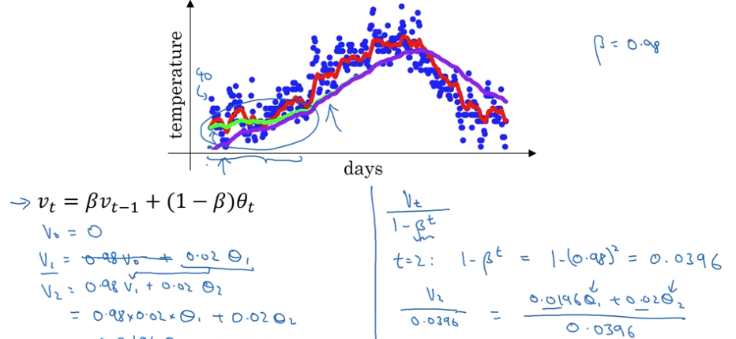
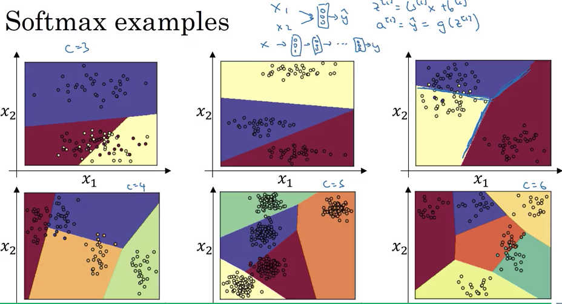

# Improving Deep Neural Networks: Hyperparameter tuning, Regularization and Optimization

Notes from course-2 of the [Deep Learning specialization](https://www.coursera.org/specializations/deep-learning) in Coursera

- [Improving Deep Neural Networks: Hyperparameter tuning, Regularization and Optimization](#improving-deep-neural-networks-hyperparameter-tuning-regularization-and-optimization)
  - [Week 1 - Setting up your ML application](#week-1---setting-up-your-ml-application)
    - [Choosing train/dev/test sets](#choosing-traindevtest-sets)
    - [Bias and Variance](#bias-and-variance)
    - [Basic recipe for Machine Learning](#basic-recipe-for-machine-learning)
    - [Regularization](#regularization)
    - [Why regularization reduces overfitting?](#why-regularization-reduces-overfitting)
    - [Dropout Regularization](#dropout-regularization)
    - [Understanding Dropout - Why it works?](#understanding-dropout---why-it-works)
    - [Other Regularization Methods](#other-regularization-methods)
    - [Normalizing Inputs](#normalizing-inputs)
    - [Vanishing/Exploding Gradients](#vanishingexploding-gradients)
    - [Weight initialization for deep networks (single neuron example)](#weight-initialization-for-deep-networks-single-neuron-example)
    - [Numerical approximation of gradients](#numerical-approximation-of-gradients)
    - [Gradient checking](#gradient-checking)
    - [Gradient Checking Implementation Notes](#gradient-checking-implementation-notes)
    - [Summary-week1](#summary-week1)
    - [References](#references)
  - [Week 2 Optimization Algorithms](#week-2-optimization-algorithms)
    - [Mini-batch gradient descent](#mini-batch-gradient-descent)
    - [Understanding mini-batch gradient descent](#understanding-mini-batch-gradient-descent)
    - [Exponentially Weighted Averages](#exponentially-weighted-averages)
    - [Understanding exponentially weighted averages](#understanding-exponentially-weighted-averages)
    - [Bias Correction](#bias-correction)
    - [Momentum](#momentum)
    - [Root Means Square (RMS) Prop](#root-means-square-rms-prop)
    - [Adam Optimization](#adam-optimization)
    - [Learning Rate Decay](#learning-rate-decay)
    - [Problem of local optima](#problem-of-local-optima)
    - [Summary-week2](#summary-week2)
  - [Week 3 - Hyperparameter Tuning, Programming Frameworks](#week-3---hyperparameter-tuning-programming-frameworks)
    - [Tuning Hyperparameters](#tuning-hyperparameters)
    - [Using an appropriate scale](#using-an-appropriate-scale)
    - [Tuning in Practice, Pandas Vs Caviar](#tuning-in-practice-pandas-vs-caviar)
    - [Normalizing activations in a network](#normalizing-activations-in-a-network)
    - [Fitting Batch Norm to a network](#fitting-batch-norm-to-a-network)
      - [Implementing batch norm](#implementing-batch-norm)
    - [Why batch norm works?](#why-batch-norm-works)
    - [Batch norm at test time](#batch-norm-at-test-time)
    - [Softmax Regression](#softmax-regression)
    - [Training a softmax classifier](#training-a-softmax-classifier)
    - [Deep Learning Frameworks](#deep-learning-frameworks)
    - [TensorFlow](#tensorflow)
    - [TODO](#todo)

## Week 1 - Setting up your ML application

### Choosing train/dev/test sets

- Applied ML is highly iterative..remember idea==>code==>experiment cycle.
- Many different applications..but the intuition from one application may not transfer to other application due to differences in data
- Trends in choosing the train/dev/test datasets. dev set is nothing but cross-validation set.
- Typical split used to be: 60-20-20
- For some big data applications, the ratio would be something in the order of 98:1:1 or even lesser.
- Mismatched train/test distributions
  - E.g cat classifier
  - training set - cat pictures from webpages
  - dev/test set - cat pictures from user uploaded images
  - make sure that dev/test set come from the same distribution
- Sometimes it might be okay to not have a test set. (some people may call train/dev set as train/test set.) Why test set is needed? - to eliminate bias and avoid overfitting to the training set.

### Bias and Variance

- Difficulties in plotting decision boundary in higher dimensions
- Find the error in train set and dev set. If the error on dev set is significantly higher than the train set, that signals some level of overfitting to the train set. High Variance.
- If the training set error itself is high, then classifier is not fitting the train set properly. Underfitting. High Bias.
- Some examples of diff train and dev set errors and their meaning.

| Train set error | dev set error | Bias | Variance | Fitting    |
| --------------- | ------------- | ---- | -------- | ---------- |
| 1 %             | 11%           | Low  | High     | over       |
| 15%             | 16%           | High | Low      | under      |
| 15%             | 30%           | High | High     | wrong      |
| 0.5%            | 1%            | Low  | Low      | just right |

- Assumption: human error is ~0%
- Optional (Bayes) error
- Example of high bias and high variance - mix of underfitting and overfitting
- 

### Basic recipe for Machine Learning

- Systemic way to tune the performance
- After training the algorithm, ask some questions
  - High bias(on train set)? - retry using bigger network, more iterations, or different NN architecture
  - High variance(on dev set)? - retry with more data, regularization, or different architecture
- Bias-Variance tradeoff - in the previous days, we used to tradeoff one for other. Regularization may some times add some bias when trying to reduce the variance.

### Regularization

- To prevent overfitting by reducing variance
- Objective of logistic regression: minimize cost function $J(w, b) = \frac{1}{m} \sum_{i=1}^m L(\hat{y}^{(i)}, y^{(i)})$
- Add the regularization factor to the cost ($\lambda$ - is the regularization parameter)
- $J(w, b) = \frac{1}{m} \sum_{i=1}^m L(\hat{y}^{(i)}, y^{(i)}) + \frac{\lambda}{2m} \parallel w\parallel^2$
- "Frobenius norm" - sum of square of elements of a matrix (not confuse with L2 norm in linear algebra)
- Why only $W$ is regularized, but not $b$? $W$ is often a multi-dimension matrix, whereas $b$ is of smaller dimension vector. Experiements show that regularizing the bias vector adds only very little.
- Types
  - L1 regularization, w will end up sparse, this type not used often.
  - L2 regularization - commonly used.
- $dw = dw + \frac {\lambda}{m}w^{[l]}$, regularize $\partial w$ during backpropagation
- Aka weight decay - why? $W$ is eventually multiplied by $(1 - \frac{L\lambda}{m})$ when we update $W$ after backpropagation.

### Why regularization reduces overfitting?

- Trying to explain in my own words. Both the cost function and the weights are penalized by the regularization factor. High value of $\lambda$ will bring $W$ closer to 0, because of weight decay (remember $W$ gets multiplied by $(1 - \frac{L\lambda}{m})$ in the update phase). Neurons with near-zero weights in the hidden units have very little to no effect on the result. That makes the pipeline more linear and thus reduces the complex non-linear fit in the decision boundary curve.
- 
- More intuition..this time using $\tanh$ function. If weights are low, then $Z$ will also be significantly low, and ends up linear as seen in the $\tanh$ curve.
- 

### Dropout Regularization

- For each training example, drop random neurons in the network and their connections to other neurons. This reduces the number of units participating in predicting the output.
- 
- Implementing Dropout - using *Inverted dropout*, which is the most common dropout method. How to implement?

  ```python
  # For e.g. take number of layers L = 3
  # After computing a3 through a forward propagation, update
  # a3 as below

  # define the probability of keeping a neuron in a3
  # can be a random value too. (need to know if there is a way
  # derive this more systematically)
  keep_prob = 0.8

  # make a new vector of same dimension as a3 with random values
  d3 = np.random.rand(a3.shape[0], a3.shape[1])

  # pick only the neurons meeting the keep-probability
  d3 = d3 < keep_prob # element wise comparsion

  # update a3..ie keep only the ones having the desired probability
  a3 = np.multiply(a3, d3) # same as a3 * d3

  # to compensate for the loss of certain neurons (1 - keep_prob), we bump
  # up the value by the same percent.
  # This is still unclear to me as to how it makes a difference
  a3 = a3 / keep_prob

  # Is it why this method is called inverted dropout?
  ```

- The random values clears out random units for each training example.
- Dropout applied only during training time. Not during test time. Adding dropout during test time will add unnecessary noise.
- *keep_probability* is also a hyperparameter.

### Understanding Dropout - Why it works?

- Why dropout? - to reduce overfitting and improve regularization
- Intuition - Can't rely on any one feature, so spreading weights
- Spreading the weights will shrink the $\parallel w \parallel^2$ - squared norm of the weights - that acheives the similar effect as L2 regularization.
- When you shut some neurons down, you actually modify your model. The idea behind drop-out is that at each iteration, you train a different model that uses only a subset of your neurons. With dropout, your neurons thus become less sensitive to the activation of one other specific neuron, because that other neuron might be shut down at any time.
- 
- Dropout can be applied to input layer technically, but not recommended.
- Can very the keep probability for every layer. For layers that are not expected to overfit, keep-probability can be set to a high value.
- Dropout often applied in computer vision, because lack of high precision data in the training set.
- Side effect: Cost function J becomes little indeterministic because of random dropouts. Makes debugging little difficult. Turn off dropout and calculate cost curve to debug and then turn it on.

### Other Regularization Methods

- **Data augmentation**
  - to increase the training set size synthetically. E.g. images in cat classifier. Augment existing images by flipping them, rotating etc. An inexpensive way to generate more data. Remember: adding more training examples will help in reducing overfitting.
  - Optical Character Recognition - introduce distortion in the training set.
  - 
- **Early Stopping**
  - Plot the cost curve for training set and dev set. Pick the parameters at the lowest cost before it starts going up.
  -  
  - Orthogonalization - Solving for minimization of cost problem and overfitting problem independently.
  - Downside of early stopping: breaks orthogonality

### Normalizing Inputs

- Normalizing? Bring all input features under same scale.
- Steps:
  - Subtract the mean ($\mu$)
  - Normalize variance ($\sigma^2$)
  - Use same mean and variance to normalize training and test set
- 
- Why normalize?
  - Difference between unnormalized and normalized
  - 
  - Normalizing helps to train faster (and converge faster)

### Vanishing/Exploding Gradients

- Derivatives may get too small or too big sometimes, and makes gradient descent very difficult.
- For deeper networks, $\hat y$ can get exponentially small (w < identity) or large (w > identity).
- Picture explains how it can happen.(*Note*: I didn't understand why $w^{[l]}$ alone is taken different than other $w$ values)
- 
- Some modern networks can have 100+ layers (Microsoft recently came up with one such network, see [here](https://www.wired.com/2016/01/microsoft-neural-net-shows-deep-learning-can-get-way-deeper/) and [here](https://blogs.microsoft.com/ai/microsoft-researchers-win-imagenet-computer-vision-challenge/)). [Original research paper](https://arxiv.org/pdf/1512.03385.pdf).
- can be alleviated to some extent (partial solution) by choosing the right weights

### Weight initialization for deep networks (single neuron example)

- $Z = W_1X_1 + W_2X_2 + .. + W_nX_n$ + b, larger $n$ requires smaller $w_i$ to keep Z sufficiently small.
- Can acheive this by keep the variance to be of certain value. That target variance can vary with the activation function

| Activation | Target Variance      |
| ---------- | -------------------- |
| ReLu       | $\frac{2}{n}$        |
| tanh       | $\sqrt{\frac{2}{n}}$ |

- `w[l] = np.random.rand(dim1, dim2) * np.sqrt(2/n[l-1])`
- 
- Choosing the right random values is another big problem in math

### Numerical approximation of gradients

- Gradient checking - used to validate implementation of back propagation
- Nudge $\theta$ on either side instead of only to the right. Find derivative using both. I didn't understand the math behind this much. The end result is that the approximation error is much lower with the two sided approximations. It runs slower than the one sided approximation, but is more accurate.
- 

### Gradient checking

- How to verify our implementation of back propagation?
- Reshape all $W$ and $b$ into a giant vector $\theta$ - make cost function $J$ as a function of $\theta$ instead of $W$ and $b$
- Likewise, reshape derivatives of $W$ and $b$ as well into $\partial \theta$
- Take $\theta$ from every iteration, find $\partial \theta_{approx}[i]$
  $$ \frac{\partial J}{\partial \theta} = \lim_{\varepsilon \to 0} \frac{J(\theta + \varepsilon) - J(\theta - \varepsilon)}{2 \varepsilon} $$
- To validate: measure how close $\partial \theta_{approx}$ is to $\partial \theta$ (i.e. flattened vector of actual gradients computed from back propagation). How to measure this? Euclidean distance is the key.
- 
- The ratio of Euclidean distance should be close to the $\epsilon$ as possible for a good result
- Very effective in catching bugs in the implementation

### Gradient Checking Implementation Notes

- Don't use gradient checking in training. Use it only to debug. Because, gradient checking process is quite slow
- If algorithm fails grad check (i.e. $\partial \theta_{approx}$ varies a lot from $\partial \theta$), look at the components dW and db to identify bug
- Remember regularization - $\partial \theta$ should also include the regularization term
- Doesn't work with dropout. Cost is difficult to compute when we drop random units and therefore makes gradient check unreliable. Tip: Turn off drop-off, run gradient check, turn drop-off back on.

---

### Summary-week1

- Split datasets into train, dev and test before fitting the model. Typical ratio used to be 60:20:20, now most applications use 98:1:1 (can vary). Why we split?
- To improve overall accuracy by reducing the bias and variance of our model. Bias & Variance can have different impacts on the model based on how low and how high they are. High variance tells us that a model fits the training set perfectly, but fails to generalize it test set. That is also called **overfitting**. How can we fix that?
- **Regularization** - penalize some of the units in the neural network to avoid overfitting to the training set. It starts from the cost function. Since gradients are calculated based on the cost  function, we have to regularize the gradients as well. Regularizing gradients will negatively impact the weights as well because we update the parameters (weights and bias) after backpropagation. That's called **weight decay**
- Methods of regularization
  - L2 regularization (using L2 norm). Uses the hyperparameter $\lambda$
  - Dropout regularization (detailed below)
  - Data augmentation - augment existing training data to generate more training data which reduces the overfitting.
  - Early Stopping - Plot the cost curve and stop at the lowest point.
- **Inverted Dropout** is the most common droput method. Randomly shutdown some units in the network for each iteration. *keep_probability* determines the percentage of nodes to shutdown in each iteration. It is also a hyperparameter. This technique reduces the dependencies of one neuron to other in the model. Use it only during training time, not during test time.
- Normalization - to keep the all examples on the same scale. Different feature may have different units. Makes it slower to converge. Normalizing the mean and variance helps to converge faster.
- Gradients can some times explode or vanish exponentially depending on the weights. Initializing random values to the weight matrix itself a big research topic. Different activation functions have different initialization factors. Famous initializations: Xavier initialization, He initialization
- After applying regularization and normalization techniques, how can we validate that implementation is right? Especially back propagation.
- **Numerical approximation by gradient checking** - mathematical verification of the gradients through approximation. Approximate the parameters (weights and bias) and find the Euclidean distance between the computed gradients and the approximated gradients. A good implementation will have a distance close to $10^{-7}$. Gradient checking is computationally expensive, so we use only to verify and then turn it off during actual training time.

### References

- [Enabling private emails in github commits](https://stackoverflow.com/questions/43378060/meaning-of-the-github-message-push-declined-due-to-email-privacy-restrictions)
- When running the programming exercise notebook locally, it results in an error due to a small bug in plotting. Fixed that with the help of this [link](https://stackoverflow.com/questions/49840380/matplotlib-scatter-typeerror-unhashable-type-numpy-ndarray).
- [AI Tools in VS Code](https://github.com/Microsoft/vscode-tools-for-ai)
- [Deep Residual Net](https://blogs.microsoft.com/ai/microsoft-researchers-win-imagenet-computer-vision-challenge/) from Microsoft to compete in ImageNet

References noted while working on the programming assignemnt.

- Xavier Initialization References
  - [Andy's Blog](http://andyljones.tumblr.com/post/110998971763/an-explanation-of-xavier-initialization)
  - [Question on Quora](https://www.quora.com/What-is-an-intuitive-explanation-of-the-Xavier-Initialization-for-Deep-Neural-Networks)
  - [Original Research Paper from Xavier and Yoshua Bengio](http://proceedings.mlr.press/v9/glorot10a/glorot10a.pdf)
- [Cross entropy cost explained](https://www.youtube.com/watch?v=ErfnhcEV1O8) - In simple terms, this is nothing but the disorder between the calculated truths (AL) versus the ground truth (Y).
- Why np.random.rand() instead of np.random.randn() in calculating the dropout matrix $d$?
  - random.rand() picks samples from uniform distribution in [0, 1] (aka Normal distribution)
  - random.randn() picks samples from standard normal distribution (aka Guassian Distribution) with a mean of 0 and variance of 1. Random sample can even go even below 0 here. So we cannot use this in places where we want the values to reflect probability.
  - Thus we use random.rand() to generate dropout matrices.
  - Some references to [Standard normal distribution](http://mathworld.wolfram.com/StandardNormalDistribution.html) and [Normal distribution](http://mathworld.wolfram.com/NormalDistribution.html)

---

## Week 2 Optimization Algorithms

Optimal algorithms to improve speed of training and convergence.

### Mini-batch gradient descent

- Vectorization helps to speed up computing. but what if the training set is super large (say 5M) even for vectorized computation?
- Break training set into multiple mini sets (5K sets of 1000 examples each). Break $X$ into $X^{{1}}, X^{{2}}...$
- Batch processing is the other term for usual processing where we run one full forward prop on all training examples and then compute back prop. Whereas in mini-batch processing, we breakdown training set into mini batches and run them through our model.

  ```python
  # Pseudocode for one epoch (full pass through the training set)
  for t = 1...batch_size:
    A = forward_propagate(X[t])
    J[t] = compute_cost(X[t], A, Y[t]) # J, with m = sizeof(X[t]), with regularization
    grads = backward_prop(X[t], Y[t]) # w.r.t J[t]
  ```

### Understanding mini-batch gradient descent

- Cost curve between batch and mini-batch processing
- 
- Choosing the mini-batch size
  - size = m, == batch gradient descent, takes too long to progress
  - size = 1, == stochastic gradient descent - every example in its own batch. Loses the advantage of vectorized processing. takes too slow.
  - ideal size = 1...m, that is neither too big nor too small.
- make progress after each mini batch processing
- Some guidelines
  - m <= 2000 (for few thousands), use batch processing
  - For bigger value of 'm', pick the mini-batch sizes in the powers of 2 (64, 128, 256, 512 ..) to take advantage of memory boundaries
  - mini-batch size should be able to fit the training set within the CPU/GPU memory.

### Exponentially Weighted Averages

Some optimization algorithms are faster than gradient descent. They are built on the idea of exponentially weighted averages.

- For e.g., take daily temperature in London for a year. Plot them on a 2-D graph. We can take moving average of the daily temperature with different window sizes. Depending on the window size, the curve may be more noisy or less noisy.
- Larger window size tends to have less noise, but also susceptible to less reaction to changes in the temperate.
- Expressing EWA mathematically - $V_t = \beta V_{t-1} + (1-\beta)\theta_t$. Refer to the below imag e for sample values of $\beta$ and the window sizes.
- 
- window size of moving average ~= $\frac{1}{1-\beta}$

### Understanding exponentially weighted averages

Intuitions behind exponentially weighted average algorithms

- For e.g. consider samples over 100 days. Expanding the formula $V_t = \beta V_{t-1} + (1-\beta)\theta_t$ to all examples, we can see that each average is multiplied by exponentially decreasing factor. Hence the name exponenetially weighted moving average.
  
- Some math behind how we get $\frac{1}{1-\beta}$. Didn't understand fully.
- Sum of the coefficients is close to 1/e.
- Implementing EWA.. can be done recursively. Optimized to dynamic programming style implementation.
  ```python
  # v0 = 0
  # v1 = b*v0 + (1-b)theta1
  # v2 = b*v1 + (1-b)theta2
  # v3 = b*v2 + (1-b)theta3

  v0 = 0
  for i in range(len(thetas)):
    v0 = b*v0 + (1-b)*theta[i]
  ```

### Bias Correction

- to improve the accuracy of EWA
- In the initial phase of averaging when EWA is warming up, it starts off at a lower value especially when $\beta$ is large. It slowly catches up as 't' increases. 
- Add some bias to get better accuracy in the warming stages. As 't' increases, the bias approaches to zero.
- 
- Not many real-world ML models use bias correction though. Dr.Ng said we may need in some cases.

### Momentum

Because mini-batch gradient descent makes a parameter update after seeing just a subset of examples, the direction of the update has some variance, and so the path taken by mini-batch gradient descent will "oscillate" toward convergence. Using momentum can reduce these oscillations.. It is almost work faster than standard gradient descent always..based on exponentially weighted average

- Noisy oscillations in the gradient descent slows down the speed of learning. To avoid that, we use gradient-descent-momentum
- How it works? Compute $\partial w, \partial b$ as usual on a mini-batch. Find $V_{dw} and V_{db}$ and then update W as $W - \alpha * V_{dw}$
- 
- Smoothes the gradient descent to descend faster. Drawing analogy from physics, think of a ball rolling down in a bowl. Gradient descent gives the necessary acceleration while momentum gives the necessary velocity
- Implementation details
  - Two more hyperparameters: $\alpha$ - learning rate, $\beta$ EWA exponent
  ```python
  # some implementations tend to ignore (1-beta) component, but Dr.Ng
  # recommended not to ignore.

  # dw, db calculated from the current mini-batch

  # start with vdw and vdb as 0
  vdw = vdb = 0

  # for each iteration t
  vdw = beta*vdw + (1-beta)*dw
  vdb = beta*vdb + (1-beta)*db
  W = W - (alpha * vdw)
  b = b - (alpha * vdb)
  ```
  - Bias correction is often ignored.

### Root Means Square (RMS) Prop

- Objective: Go slow in the vertical direction (pointed by b), and go fast in the horizontal direction (pointed by w)
- Square the gradients and then take root of the sum
- RMS adds a new hyperparamter $\beta_1$ to the mix.
- *Didn't got this idea fully..but pressing ahead..*
- 
- Fun fact: This was first proposed in a Coursera course from Geoff Hington than in a research paper.

### Adam Optimization

Many optimization algorithms proposed over the years worked initially, but missed to generalize. RMS, Momentum and Adam stood out among the other optimization and gained more popularity as they could generalize more neural networks than others.

ADAM - stands for *Adaptive Moment Estimation*

Adam optimization is built on Momentum and RMS optimzations. After finding $V_{dw}$, $V_{db}$ (EWA of gradients), $S_{dw}$, and $S_{db}$ (EWA of squares of gradients) from Momentum and RMS, we then scale them with $\frac{1}{1-\beta_1^t}$ and $\frac{1}{1-\beta_2^t}$ respectively to correct bias, and then update W and b as mentioned in the update rule in the image below. Note the $\epsilon$ in the update equation. It is added to avoid running to divide-by-zero situation.


Choice of Hyperparameters as recommended by the Adam paper.

| Hyperparameter | Vaue               |
| -------------- | ------------------ |
| $\alpha$       | needs to be tuned  |
| $\beta_1$      | 0.9 (for $dw$)     |
| $\beta_2$      | 0.999 (for $dw^2$) |
| $\epsilon$     | $10^{-8}$          |

### Learning Rate Decay

Faster learning rate may sometimes oscillate more as it nears convergence, but never really converge. We can slow down the learning rate in cases like that.

Many methods to update learning rate for each iteration(epoch). Commonly used is $\alpha = \frac{1}{1 + decay_rate*epoch_num}\alpha_0$


- Other methods
  - $\alpha = 0.95^{epoch_num}.\alpha_0$ (Exponential decay)
  - $\alpha = \frac{k}{\sqrt{epoch-num}}.\alpha_0$
  - discrete staircase (learning halved at each step)
  - Manual Decay - watch the model performance, increase or decrease the learning rate manually
- In general, learning rate decay ranks low in the hyperparameter tuning. It is important to get the model working properly with fixed learning rate first and then we can apply learning rate decay.

### Problem of local optima

In a high dimensional parameter space, many local optima may turn out to be saddle point than true local optima. It is called saddle point beacuse it resembles the saddle on horse seat.


Another problem is the plateau where it is unlikely to get stuck in local optima, but the learning rate can be very very slow due to flat surface in the curve for a long time.


### Summary-week2

Covered a lot this week on advanced optimization algorithms. We had been using only gradient descent so far as the optimization algorithm and iterate (forward prop and backprop) on all training set examples using vectorization. Though the calculations are vectorized, it can take a long time to learn the paramters if the dataset is really large. So we apply some advanced optimizations to learn the parameters faster.

- **Mini-batch Gradient Descent**
  - Shuffle and partition the dataset into small batches, update parameters after each batch. One full pass of all mini-batches is called epoch. Batch size is typically in powers of 2 to keep aligned with CPU memory boundaries. Dataset is typically shuffled and partitioned after each epoch.
  - mini batch size = 1 for stochastic gradient, m for batch gradient, 1..m for mini batch
- **Exponential Weighted Average** - forms the basic idea on which further optimization algorithsm are built. It takes a moving average of the samples. Hyperparameter $\beta$ (0..1) determines the size of the moving window and the oscillations.
- **Momentum** - Analogous to momentum in physics, Gradient descent is the accelaration while momentum determines the velocity accumulated as we descend down. Update the gradients with momentum and then update the parameters. It takes the past gradients into account to smooth out the steps of the gradient descent. It can be applied to batch gradient descent, mini-batch gradient descent and stochastic gradient descent (batch size of 1)
- **RMS** - Root Mean Square - takes the square of gradients in updating the velocity and then takes the root of the velocity in updating the parameters. Uses the hyperparameter $\beta_2$
- **ADAM** - Adaptive Moment Optimization - Combines the benefits of Moment and RMS. Commonly applied optimization technique. Typical values of the ADAM Hyper-parameters: $\beta_1 = 0.9, $\beta_2 = 0.99, \epsilon = 10^{-7}$.

Learning rate decay is another hyperparameter that controls the rate of decay of learning rate. Some common methods exists to update learning rate, but also changed manually in some cases. Ranks low in the list of hyperparameters to be tuned.

## Week 3 - Hyperparameter Tuning, Programming Frameworks

### Tuning Hyperparameters

This going to be fun!

We have seen many hyperparameters so far. 

| Hyperparameter               | Name                  | Notes                                                         |
| ---------------------------- | --------------------- | ------------------------------------------------------------- |
| $\alpha$                     | learning rate         | Most important                                                |
| $\beta$                      | Momentum              | Often set to 0.9, but variable                                |
| #hidden units                | #hidden units         |                                                               |
| mini-batch-size              | mini batch size       | used in optimization                                          |
| #layers                      | number of layers      |                                                               |
| learning_rate_decay          | learning rate decay   |                                                               |
| $\beta_1, \beta_2, \epsilon$ | beta1, beta2, epsilon | used in Adam optimization. Often set to 0.9, 0.999, $10^{-8}$ |

- The above order is not a hard-and-fast rule though. When picking random values for the hyperparameters, it is recommended not to use a grid (e.g hp1 vs hp2). Pick randomly.
- Use coarse to fine - what does it mean? sample in a larger space first, then pick a small space within that large space and repeat the process.

### Using an appropriate scale

- Recommended to use logarithmic scale to pick random variables at a uniform scale
- 
- For EWA, we follow a slightly different approach.
- 
- Why linear scale is not recommended? It turns out that when randomly selected value is close to 1, model turns very sensitive to changes. So distribute the sampling space more evenly.

### Tuning in Practice, Pandas Vs Caviar

- Retest hyperparameters occasionally. Intuitions may go stale, dataset may go through rounds of changes etc. Better to re-evaluate once in a while (every few months or so)
- Babysitting one model (Panda method) vs training many models in parallel (caviar method). Selection may differ based on the applications.
- 

### Normalizing activations in a network

Makes hyperparameter search easier and increase the robustness of the neural network.

- We normalized (bring mean = 0, variance = 1) the inputs in logistic regression before. What is the network is a deep network? Can we apply normalization to hidden layers to speed up computations within the hidden layers?
- With hidden layers, we compute the linear function $Z$ and then apply the activation function $A$. Normalization is typically applied to Z than A (although some researchers follow the latter)
- Implementing batch normalization. Four key equations involved in implementation. Take network with one hidden layer, $Z$
  1. $\mu = \frac{1}{m}\Sigma_{i=1}^{m} Z^{(i)}$
  2. $\sigma^2 = \frac{1}{m}Sigma_{i=1}^{m} (Z^{(i)} - \mu)^2$
  3. $Z_{norm}^{(i)} = \frac{Z^{(i)} - \mu}{\sqrt{\sigma^2 + \epsilon}}$
  4. $\tilde{Z}^{(i)} = \gamma Z_{norm}^{(i)} + \beta$ (This $\beta$ is different from $\beta$ used in ADAM optimzation)
- The fourth equation is important. Though we normalize, hidden layers may have different activation functions and the values may not fit well within the normal distribution. Bringing the mean=0 and variance = 1 in those cases will not be that helpful. So vary the distribution slightly using the two new parameters $\gamma$ and $\beta$. These two parameters are learnable - i.e they are updated just like our parameters $W$ and $b$ as go through different iterations.
- 
- If $\gamma = \sqrt{\sigma^2 + \epsilon}$ and $\beta = \mu$, then it makes $Z_{norm}^{(i)} = Z^{(i)}$, in other words, this combination of values cancels out the normalization. This is an example of how the normalization can be controlled with these two parameters.

### Fitting Batch Norm to a network

Previously we implemented normalization to one hidden layer using the parameters $\gamma$ and $\beta$. Extending that to a deeper network with multiple layers, needs $\gamma$ and $\beta$ for every layer as the number of hidden units could vary. Because of this requirement, $\gamma$ and $\beta$ are also included in our base parameters along with $W$ and $b$. 

- For each layer, compute the linear function Z, apply normalization and then apply activation function.
- $\gamma$ and $\beta$ are learnable parameters, so they are also updated just like $W$ and $b$ in the back propagation step.($\gamma = \gamma - \alpha*\partial \gamma$ and $\beta = \beta - \alpha*\partial \beta$)
- Optimizations like RMS Prop, Moment and ADAM can be applied to the normalization parameters as well.
- **Note**: Since normalization brings the mean and variance to 0 and 1, any constant we add to Z gets canceled out during normalization. So our bias vector $b$ becomes insignificant when using batch normalization. It is often initialized to all zeros or not used at all when batch norm is applied.

#### Implementing batch norm

- Batch norm is typically applied to the mini batches
- $\gamma$ and $\beta$ are of the same shape as $b$, typically ($n^{[l]}$, 1)
- Most programming frameworks already have implemented batch normalization, so we can directly call the function (e.g. `tf.batch_normalize()`) instead of writing our own implementation.
  


### Why batch norm works?

Take our standard example of cat classifier. If the model is trained only with black cats, then it might not do well if the test set contains different colored cats. This happens because the data comes from different distributions.


The shift in the predictions X-->Y, when the distribution changes is called the *Covariance shift*.

- **Why covariance shift is problematic to neural networks**? Each hidden layer is trained to predict Y given input A from the previous layers. So change in the distribution of input will cascade into the hidden layers and affect the prediction too.
- Batch norm reduces the covariance shift by zeroing out the mean and bring the variance to 1 in each layer. Consequently, prediction accuracy also improves.
- **Batch norm as regularization** - regularization is not the intent of batch norm, rather an unintended consequence. Since batch norm is applied in mini-batches, mean/variance will likely be little noisy between the mini-batches. Since we scale each mini batch by the normalization parameters, this also adds some regularization to each hidden layer activations like the $\lambda$ parameter in L2 norm. This side effect can be reduced by choosing a larger mini batch size. Take away: Do not use batch-norm as a means of regularization intentionally.

### Batch norm at test time

Mini-batch norm is typically applied only during training time as test set need not have enough inputs to form mini batches. At times, we may even have only one example in the test set. Finding mean and variance on one example doesn't make sense. So we derive $\mu$
and $\sigma$ for our test set from the EWA of the mean and variance from each layer during the training time.


### Softmax Regression

This is multi-class logical regression where the model classifies the input into one of the multiple output classes.

Notations:
C = #classes

E.g. Images classfied into cats, dogs and chicks. The final output layer will have a probability for each of the classes.


- The key difference between logistic regression and softmax regression lies in the activation function. Logistic regression uses the sigmoid function. Whereas in softmax, we use the following activation function.
- Compute a temporary function $t = e^{Z[l]}$, taking exponents element wise. Then update $a^{[l]} = \frac{t_i}{\sum_{j=1}^C} t_i$ - this basically zeros out the mean. I don't know why we use the temporary function and the math behind that. Below image shows an example of softmax layer with 4 classes.


Some examples of softmax. You can see that decision boundaries separating the classes is actually linear though.


### Training a softmax classifier

Softmax comes from contradicting to a concept called "Hard max". Hard max sets the largest value to 1 and zeros out the rest. Whereas softmax reduces the input to a softer value (it doesn't zero out completely. The reduced values do match the pattern of the input values)


- What about loss function? - uses a form of maximum likelihood estimation in statistics. In simple terms, the loss function we use here is $L(\hat{y}, y) = -\sum_{y=1}^{C}y_jlog(\hat{y_j})$, for multiple examples $J = (1/m)\sum_{i=1}^{m}L(\hat{y}^{(i)}, y^{(i)})$. Larger the value probability inside $\hat{y}^{(i)}$, lower the cost, better the prediction.
- Dimension of Y used to be (1, m) with logistic regression. With softmax with multiple classes, dimension of Y becomes (C, m).
- **Gradient Descent** - First step of the back propagation starts with a different equation when using softmax regression. $dz^{[l]} = \hat{y} - y$. With Tensorflow, the framework automatically takes care of finding the derivative. We do not have to implement this derivation ourselves.

### Deep Learning Frameworks

My favorite topic of this week!

Some famous frameworks.


Takeaway: Pick truly open source, not pseudo open.

### TensorFlow

Taking a sample cost function and minimizing it using tenserflow.

< add sample code - basic, with tf functions >

< add sample code - with equation >

< add sample code - with place holder>

In the background, a computation graph is constructed from the cost function. Using that, tf automatically figures out the derivates of the functions in the computation graph using built-in functions and does backward propagation.

### TODO

- [ ] Add code to tensorflow section
- [ ] Find answers to the sampling question in the quiz
- [ ] Finish programming assignment
- [ ] Post week3 summary