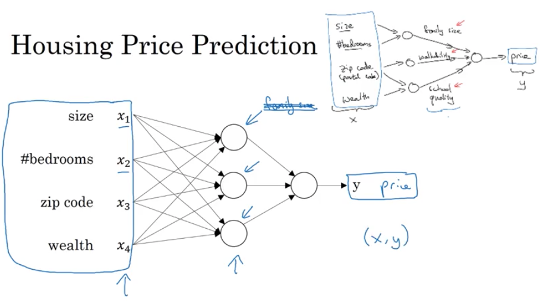
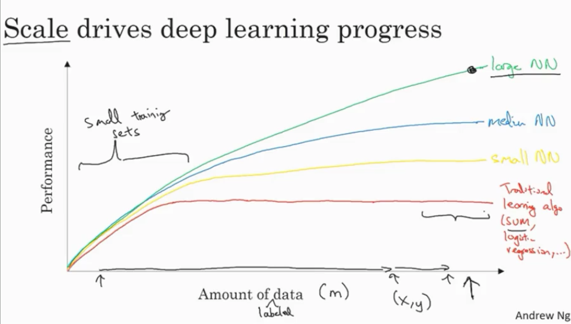
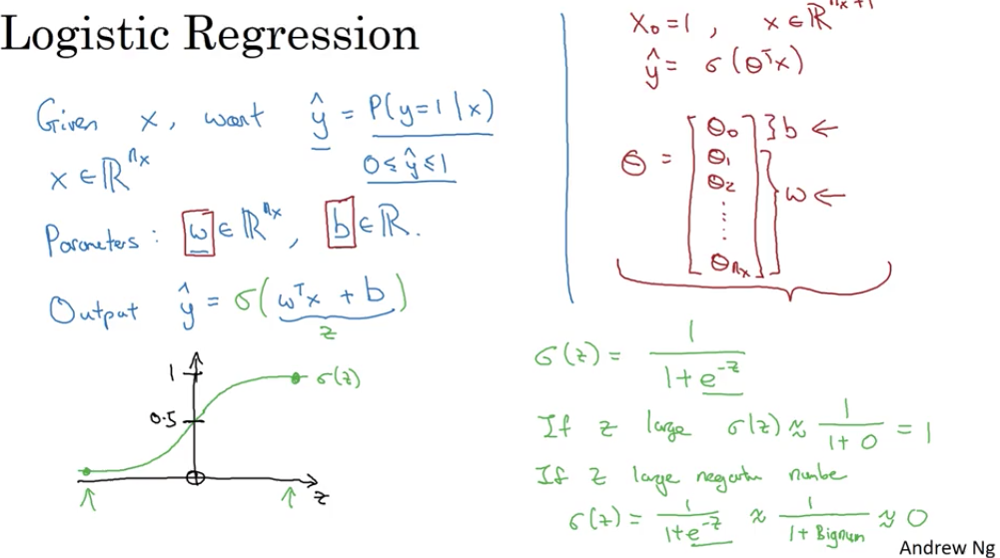
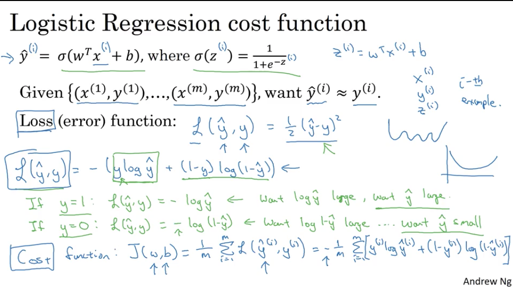
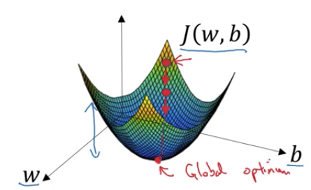
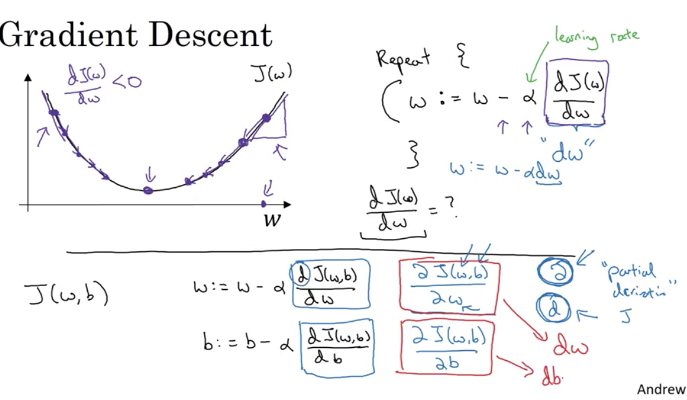
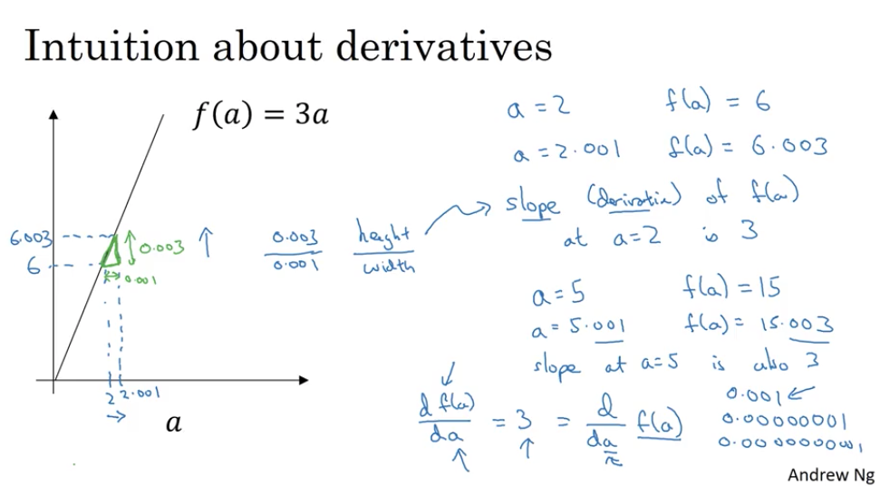
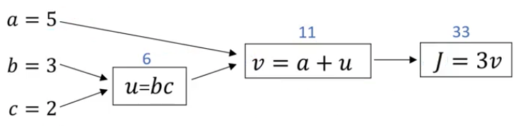
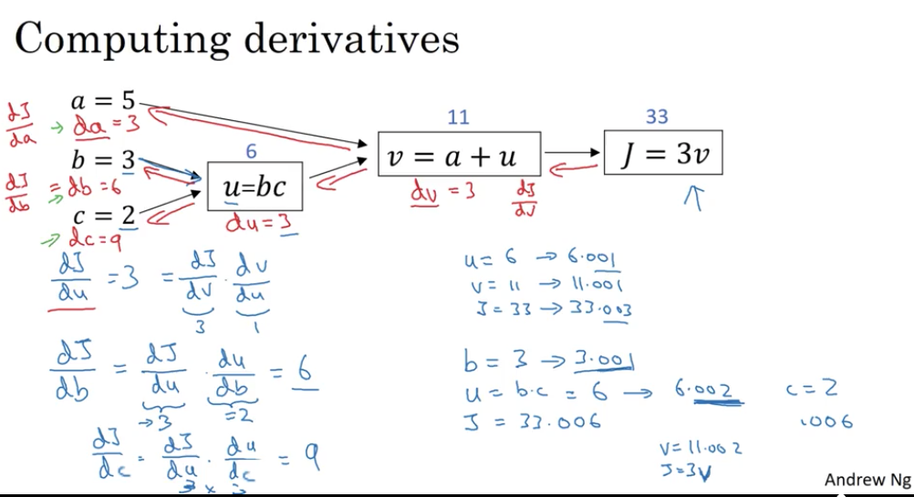

# Deep Learning Course Notes

## Week 1
### Introduction
* AI - impact of AI analagous to impact of Electricity 
* Specialization outline
    * Basic Deep Learning
    * Hyperparameters tuning, regularization, optimization
    * Building a project
    * CNN
    * RNN
    * Shallow learning vs Deep learning

### Neural networks intuition
* E.g. housing price prediction
* Consider each node as a ReLU (Rectified Linear Unit)..can sometimes use non-linear function too, depending on the problem in hand

* Applications in supervised learning

### Supervise Learning with NN
* Lots of famous applications
* Using standard neural networks
    * Real Estate (house price prediction)
    * Online ads based on user info - predict click
* Using Convolution Neural Network (CNN) 
    * Image recognition
* Using Recurrent Neural Network (RNN)
    * Speech recognition
    * Language translation
* Hybrid
    * autonomous driving - decide direction based on the image, position of other cars on road - custom NN
* Supervised learning
    * Structured Data
    * Unstructured Data
        * Audio
        * Image
    * Short term value creation of NN - much in the structured data. although it is immensely useful in unstructured data as well

### Why deep learning is taking off?
* Data availability vs performance graph

* With smaller data sets, performance of NN doesn't necessarily increase as we scale up the size of NN.
* Algorithmic innovation drove innovation and efficiency in computation
* sigmoid function vs ReLU
    * Slow learning rate (gradient is nearly 0) on either ends of the sigmoid curve
    * ReLU - better learning rate
* Building a neural network is more of a iterative approach - Idea --> Code --> Experiment --> Idea --> Code...

### Interview with [Geoffrey Hinton](https://en.wikipedia.org/wiki/Geoffrey_Hinton)
* Inspired from brain science.. background in Physiology and Physics.. then some psycology..then carpentry.. then AI
* Co-invented back propagation algorithm
* Graph representation <--> Feature vector
* Boltzman machine - Geoffrey considers this as his best - Restrcited Boltzman machine 
* Deep Belief Nets
* ReLU - somewhat equivalent to stacked logistic units
* Backprop and Brain - Geoffrey is working on a paper..is brain really using backprop? referred to brain plasticity in connection to how brain learns
* Some more advanced concepts that stick to my brain :-(
* He works with Google Brain team too
* Discriminative learning - refers to supervised learning. In initial days, lot of focus on unsupervised learning as that is how brain is believed to learn. Recent advancements in deep learning with supervised learning, especially in the last ten years or so really pushed the focus in a different direction. unsupervised learning is still largely unsolved problem. 
* Advice to people who wants to get into deep learning - trust your intuitions 
* Google Brain residents? 
* Geoffrey did the first MOOC on deep learning on Coursera
* Thoughts - as symbolic expression vs vectorized ops
* Haven't heard about him before this talk. After reading few articles, I realized why he is rightly referred as Godfather of AI/Deep Learning. Respect!

## Week 2 - Basics of Neural network programming
### Binary classification
* Determine a given image is of cat or not
* 64 pixel image in the example. each pixel in the image represented by three values Red, Green and Blue
* That's 3 64x64 matrix
* Notations:
    * X - Nx x m matrix, m - number of training examples, Nx - number of features
    * Y - [y1 y2...ym] - 1 x m matrix
    * Can obtain by the shape (dimension) of the matrix in python by X.shape, Y.shape
    * *Note: In earlier course (machine learning), we used the X matrix as mxn matrix, whereas we use nxm here.*
    * *[This wiki article](https://en.wikipedia.org/wiki/List_of_XML_and_HTML_character_entity_references) came in handy to refer to symbols in markdown*
  
### Logistic Regression
* Given X, want Y = P(y=1 | x)
* Cannot use linear regression (&theta;Tx + b) here as the output value is not a continuous number. we want the probability.. value in the range 0..1
* Comes the sigmoid function &sigma;(z) = 1 / (1 + e-z)
* 

### Logistic Regression Cost function
* Takeaway from last video: &theta; replaced by `w` and X0 replaced by `b` in the notations.
* Linear regression uses squared error function..applying that here will give many local optima instead of a global optima. so we use a different error function for logistic regression
* $L(y', y) = - (ylogy' + (1-y)log(1-y'))$
* Below image explains why this error function makes sense for logistic regression.
* Loss/Error function - computes the error for single training example
* Cost function - average of the loss functions of the entire training set.
* 
  
### Gradient Descent
* Hypothesis function: y' = &sigma;(wTx + b), &sigma;(z) = 1 / (1 + e-z)
* Cost function: J(w, b) = 1/m L(y'(i), y(i))
* Loss function: $L(y', y) = - (ylogy' + (1-y)log(1-y'))$
* want to find w, b that minimizes $J(w, b)$
* cost function here is a convex function

* To minimize w and b, we repeatedly reduce w, b by a small factor at every step of the descent. 'small factor' here referes to the partial derivate of the cost function with respect to w ($dJ(w, b)/dw)$ and b($dJ(w, b)/db)$, multiplied by the learning rate &alpha;
* In simple terms, derivative is the direction of the slope. Depending on where we are in the cost curve, derivatives will lead us to the local optima
* In the code, derivative of parameter `w` is denoted as `dw` and `b` is denoted as `db`
* 

### Derivatives - Intuition
* Derivative == slope
* how much $f(a)$ changes with respect to changes in $a$
* 

### More Derivative Examples
* $f(a) = a^2$, slope varies at different points of $a$ for this $f(a)$
* e.g. a = 2, f(a) = 4
* If a = 2.001, then f(a) ~= 4.004 - if we nudge a by 0.001, then f(a) changes by 4 times the nudge factor.
* If a = 5, f(a) = 25, a = 5.001 then f(a) ~= 25.01. Here f(a) changes by 10 times the nudge factor.
* Change in f(a) is denoted by the slope of the curve that f(a) generates. Derivative of the f(a) gives the slope. 
* Math formula: $\frac{d}{da}f(a) = \frac{d}{da} a^2 = 2a$
* Some more examples

f(a) | derivative
---- | ----------
$a^2$| $2a$
$a^3$| $3a^2$
$log_e(a)$ | $\frac{1}{a}$

### Computation Graphs
* Why neural network is organized as forward prop and back prop?
* E.g. function $J = 3(a + bc)$ - visualize this computation as a graph
* 
* On forward prop, we compute J from u and v
* On backward prop, we compute the derivates of a, b, c $da, db, dc$ - how much J changes with respect to changes in a, b and c.
* There is a lot in this picture. Observe each components carefully to see what is going on. The red color variable names are used as variable names in Python in the coding examples too.
* 
* In general, d*var* represents derivative of the final output (typically the cost function or error function) with respect to the input or intermediate values

### Logistic Regression Gradient Descent
* like the previous example, the input parameters here are:
    * X - [x1, x2]
    * w - [w1, w2] - This is nothing but $\theta$ parameter that we used in the earlier class
    * b - bias parameter
* Gradient descent tells us the direction and magnitude to go from the current values of w1, w2 and b.
* Find dw1, dw2 and db, then find the new values of w1, w2 and b by using the learning rate and descent.
* 
  
### Logistic Regression on $m$ examples