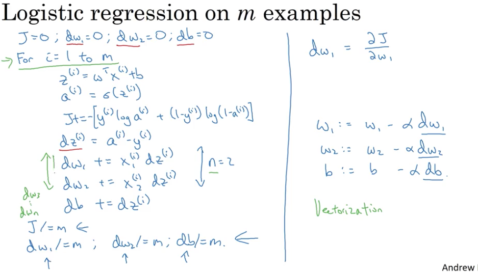
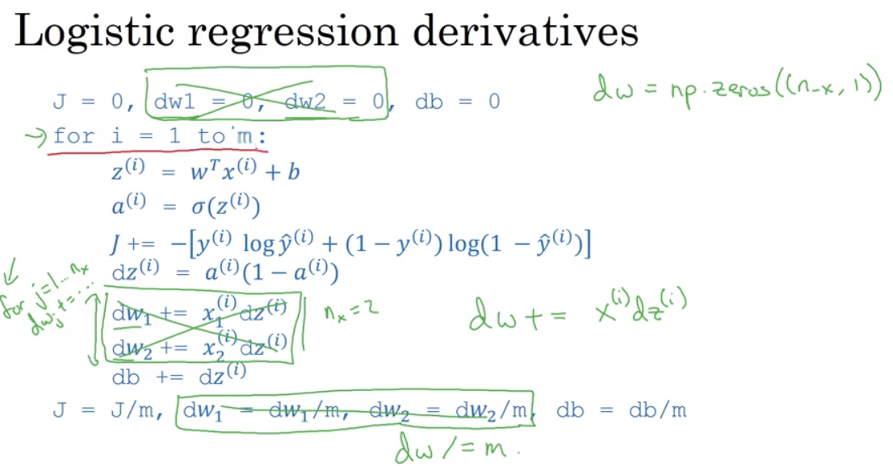
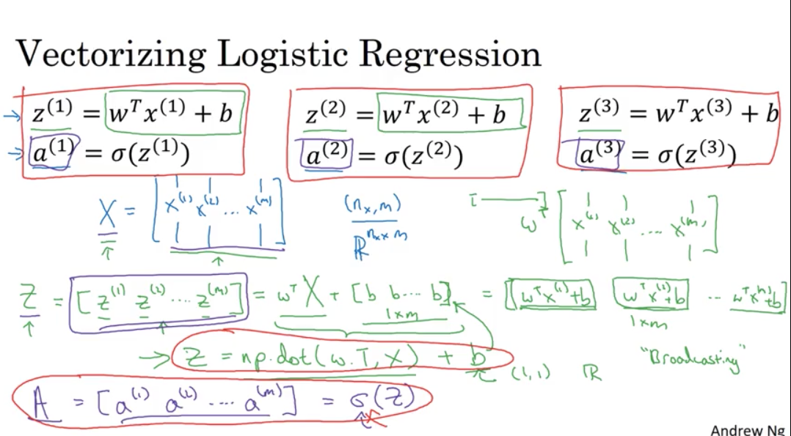
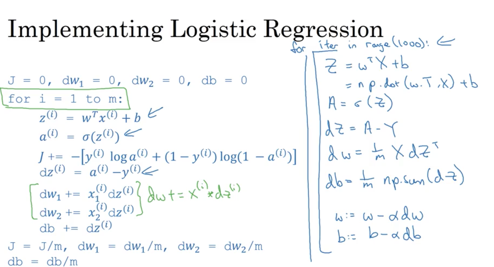

# Deep Learning Course Notes

## Week 1
### Introduction
* AI - impact of AI analagous to impact of Electricity 
* Specialization outline
    * Basic Deep Learning
    * Hyperparameters tuning, regularization, optimization
    * Building a project
    * CNN
    * RNN
    * Shallow learning vs Deep learning

### Neural networks intuition
* E.g. housing price prediction
* Consider each node as a ReLU (Rectified Linear Unit)..can sometimes use non-linear function too, depending on the problem in hand

* Applications in supervised learning

### Supervise Learning with NN
* Lots of famous applications
* Using standard neural networks
    * Real Estate (house price prediction)
    * Online ads based on user info - predict click
* Using Convolution Neural Network (CNN) 
    * Image recognition
* Using Recurrent Neural Network (RNN)
    * Speech recognition
    * Language translation
* Hybrid
    * autonomous driving - decide direction based on the image, position of other cars on road - custom NN
* Supervised learning
    * Structured Data
    * Unstructured Data
        * Audio
        * Image
    * Short term value creation of NN - much in the structured data. although it is immensely useful in unstructured data as well

### Why deep learning is taking off?
* Data availability vs performance graph

* With smaller data sets, performance of NN doesn't necessarily increase as we scale up the size of NN.
* Algorithmic innovation drove innovation and efficiency in computation
* sigmoid function vs ReLU
    * Slow learning rate (gradient is nearly 0) on either ends of the sigmoid curve
    * ReLU - better learning rate
* Building a neural network is more of a iterative approach - Idea --> Code --> Experiment --> Idea --> Code...

### Interview with [Geoffrey Hinton](https://en.wikipedia.org/wiki/Geoffrey_Hinton)
* Inspired from brain science.. background in Physiology and Physics.. then some psycology..then carpentry.. then AI
* Co-invented back propagation algorithm
* Graph representation <--> Feature vector
* Boltzman machine - Geoffrey considers this as his best - Restrcited Boltzman machine 
* Deep Belief Nets
* ReLU - somewhat equivalent to stacked logistic units
* Backprop and Brain - Geoffrey is working on a paper..is brain really using backprop? referred to brain plasticity in connection to how brain learns
* Some more advanced concepts that stick to my brain :-(
* He works with Google Brain team too
* Discriminative learning - refers to supervised learning. In initial days, lot of focus on unsupervised learning as that is how brain is believed to learn. Recent advancements in deep learning with supervised learning, especially in the last ten years or so really pushed the focus in a different direction. unsupervised learning is still largely unsolved problem. 
* Advice to people who wants to get into deep learning - trust your intuitions 
* Google Brain residents? 
* Geoffrey did the first MOOC on deep learning on Coursera
* Thoughts - as symbolic expression vs vectorized ops
* Haven't heard about him before this talk. After reading few articles, I realized why he is rightly referred as Godfather of AI/Deep Learning. Respect!

## Week 2 - Basics of Neural network programming
### Binary classification
* Determine a given image is of cat or not
* 64 pixel image in the example. each pixel in the image represented by three values Red, Green and Blue
* That's 3 64x64 matrix
* Notations:
    * X - N<sub>x</sub> x m matrix, m - number of training examples, Nx - number of features
    * Y - [y<sup>1</sup> y<sup>2</sup>...y<sup>m</sup>] - 1 x m matrix
    * Can obtain by the shape (dimension) of the matrix in python by X.shape, Y.shape
    * *Note: In earlier course (machine learning), we used the X matrix as mxn matrix, whereas we use nxm here.*
    * *[This wiki article](https://en.wikipedia.org/wiki/List_of_XML_and_HTML_character_entity_references) came in handy to refer to symbols in markdown*
  
### Logistic Regression
* Given X, want Y = P(y=1 | x)
* Cannot use linear regression (&theta;<sup>T</sup>x + b) here as the output value is not a continuous number. we want the probability.. value in the range 0..1
* Comes the sigmoid function &sigma;(z) = 1 / (1 + e<sup>-z</sup>)
* 

### Logistic Regression Cost function
* Takeaway from last video: &theta; replaced by `w` and X<sub>0</sub> replaced by `b` in the notations.
* Linear regression uses squared error function..applying that here will give many local optima instead of a global optima. so we use a different error function for logistic regression
* $L(y', y) = - (ylogy' + (1-y)log(1-y'))$
* Below image explains why this error function makes sense for logistic regression.
* Loss/Error function - computes the error for single training example
* Cost function - average of the loss functions of the entire training set.
* 
  
### Gradient Descent
* Hypothesis function: y' = &sigma;(w<sup>T</sup>x + b), &sigma;(z) = 1 / (1 + e<sup>-z</sup>)
* Cost function: J(w, b) = 1/m L(y'<sup>(i)</sup>, y<sup>(i)</sup>)
* Loss function: $L(y', y) = - (ylogy' + (1-y)log(1-y'))$
* want to find w, b that minimizes $J(w, b)$
* cost function here is a convex function

* To minimize w and b, we repeatedly reduce w, b by a small factor at every step of the descent. 'small factor' here referes to the partial derivate of the cost function with respect to w ($dJ(w, b)/dw)$ and b($dJ(w, b)/db)$, multiplied by the learning rate &alpha;
* In simple terms, derivative is the direction of the slope. Depending on where we are in the cost curve, derivatives will lead us to the local optima
* In the code, derivative of parameter `w` is denoted as `dw` and `b` is denoted as `db`
* 

### Derivatives - Intuition
* Derivative == slope
* how much $f(a)$ changes with respect to changes in $a$
* 

### More Derivative Examples
* $f(a) = a^2$, slope varies at different points of $a$ for this $f(a)$
* e.g. a = 2, f(a) = 4
* If a = 2.001, then f(a) ~= 4.004 - if we nudge a by 0.001, then f(a) changes by 4 times the nudge factor.
* If a = 5, f(a) = 25, a = 5.001 then f(a) ~= 25.01. Here f(a) changes by 10 times the nudge factor.
* Change in f(a) is denoted by the slope of the curve that f(a) generates. Derivative of the f(a) gives the slope. 
* Math formula: $\frac{d}{da}f(a) = \frac{d}{da} a^2 = 2a$
* Some more examples

f(a) | derivative
---- | ----------
$a^2$| $2a$
$a^3$| $3a^2$
$log_e(a)$ | $\frac{1}{a}$

### Computation Graphs
* Why neural network is organized as forward prop and back prop?
* E.g. function $J = 3(a + bc)$ - visualize this computation as a graph
* 
* On forward prop, we compute J from u and v
* On backward prop, we compute the derivates of a, b, c $da, db, dc$ - how much J changes with respect to changes in a, b and c.
* There is a lot in this picture. Observe each components carefully to see what is going on. The red color variable names are used as variable names in Python in the coding examples too.
* 
* In general, d*var* represents derivative of the final output (typically the cost function or error function) with respect to the input or intermediate values

### Logistic Regression Gradient Descent
* like the previous example, the input parameters here are:
    * X - [x1, x2]
    * w - [w1, w2] - This is nothing but $\theta$ parameter that we used in the earlier class
    * b - bias parameter
* Gradient descent tells us the direction and magnitude to go from the current values of w1, w2 and b.
* Find dw1, dw2 and db, then find the new values of w1, w2 and b by using the learning rate and descent.
* 
  
### Logistic Regression on $m$ examples
* Cost function $J(w,b) = \frac{1}{m}\displaystyle \sum_{i=1}^{m} L(a^{(i)}, y^{(i)}x)$, where $\hat{y}^{(i)} = \sigma(Z^{(i)}) = \sigma(w^TX^{(i)} + b)$ 
* To find the derivatives $d/dw_1$, $d/dw_2$ and so on, we take the sum of the derivatives of the loss function with respect to each $w$
* $\displaystyle \frac{\partial}{\partial w_1} J(w,b) = \frac{1}{m}\sum_{i=1}^{m} \frac{\partial}{\partial w_1}L(a^{(i)}, y^{(i)})$
* Implementing the gradient calculation with for loop. This doesn't scale good as the data set size goes up. Vectorization to the rescue
* 

### Vectorization
* Initialized two random arrays with numpy. Taking the product of two arrays with vectorized version beats the non-vectoried version by over 300 times in the example run
* Product using for-loop
```python
a = np.random.rand(100000) # generates an array with 1M random values
b = np.random.rand(100000)

c = 0
for i in range(100000):
    c += a[i]*b[i]
end
```
* Vectorized version
```python
c = np.dot(a,b)
```
* The time taken to process this simple calculation is remarkably efficient with the vectorized implementation that takes advantage of the SIMD (Single Instruction Multiple Data) capabilities of the CPU/GPU.

### More vectorization examples
* Neural programming guidelines
    * whenever possible, avoid explicit for loops
* Computing exponential values of a matrix with for-loop and vectorization
* $v = [v_1, v_2, v_3, ... v_n]$, find $u = [e^{v_1}, e^{v_2}, e^{v_3},.. e^{v_n}]$
* For-loop
```python
u = np.zeros((n, 1)) #is (n, 1) a tuple or arg?
for i in range(n):
    u[i] = math.exp(v[i])
```
* Vectorized method
```python
import numpy as np
u = np.exp(v)
```
* Other vectorized functions
```python
np.log(v)
np.abs(v)
np.maximum(v, 0)
# many more
```
* Vectorizing logistic regression - begins with vectorizing inner loop
* 

### Vectorizing Logistic Regression
* $z^{(1)} = w^Tx^{(1)} + b$,$z^{(2)} = w^Tx^{(2)} + b$, $z^{(3)} = w^Tx^{(3)} + b$, and so on
* $w$ is of shape(aka dimension) ($n_x,1)$, X is of shape $(n_x,m)$, $w^T$ is $(1,n_x)$, that results is Z(=$w^T*X + b$) as $(1,m)$ matrix. Z computed as
  ```python
  z = np.dot(w.T, X) + b # w.T generates transpose of w
  ```
* Python automatically broadcasts the scalar value $b$ to the dimension of the other operand.
* Now calculate, A by calculating sigmoid of Z
* 

### Vectorizing Gradient Descent
* Reducing the gradient descent calculation to no for-loops using vectorized implementation
* 
* above is a single iteration of gradient descent. we will still need a for-loop to run this iteration multiple times to take further steps in the direction of the gradient descent

### Programming assignment
* Went through basics of numpy operations, functions to perform computations
* Built a simple logistic regression model to classify a image as cat or not-cat. 
* The common steps in building a model are:
    * Initialize the parameters $X$, $y$, $w$, $b$
    * Optimize - to find the values of parameters $w$ and $b$ that reduces the overall cost $J$
        * Forward propagation - find the error/loss
        * Backward propagation - gradient descent
    * Predict - using the learned parameters, predict the output of the training set and test set

### TODO
- [ ] Python notebook with numpy examples and operations
- [ ] My own version of simple model
  
### Interview with Pieter Abbeel
* Working on Deep Reinforcement Learning
* ImageNet - breakthrough in supervised learning
* Deep Reinforcement Learning - in addition to input-output mapping of supervised learning, it also finds where the input comes from.. not sure I caught this right. that phase is more about exploration of the input data
* Recent advancements in Deep Reinforcement Learning - atari games, robots self-learning to walk/run, 
* DRL - machine learning from the human interactions, e.g. Facebook Assistant

### Resources
* Markdown
    * [Markdown reference](https://guides.github.com/features/mastering-markdown/)
    * [Math equations in Markdown](https://en.wikibooks.org/wiki/LaTeX/Mathematics) - this came in very handy in writing down equations and math symbols while taking notes from the class. I found the tool [Detexify](http://detexify.kirelabs.org/classify.html) to be quite useful in finding the text for a given symbol. These [link1](https://csrgxtu.github.io/2015/03/20/Writing-Mathematic-Fomulars-in-Markdown/), [link2](https://daringfireball.net/projects/markdown/syntax) also came in handy for quick references.
    * I use Visual Studio Code to edit my markdown files. Support for math shortcuts from the markdown extension and builtin support was very useful to quickly refer to the symbols using \\.
    * Sadly Github markdown doesn't support LaTeX math equations natively as there is no MathJax support. So the equations didn't render nicely in the Github preview.
    * The alternate options are:
        * [Code Cogs](https://www.codecogs.com/latex/eqneditor.php) - turn the equations into a SVG image and embed the link to the image. But staying away from it for now as it adds additional work while I take the notes. I might go for it if I had to add equations more often. 
        * Load the markdown file into a iPython notebook at the end of the course. IPython supports LaTeX equations and Github renders IPython notebook quite effectively.
* [Machine learning is fun - Building a CNN image classifier](https://medium.com/@ageitgey/machine-learning-is-fun-part-3-deep-learning-and-convolutional-neural-networks-f40359318721)

